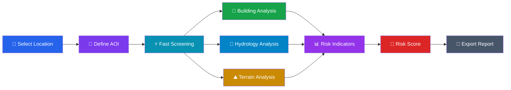
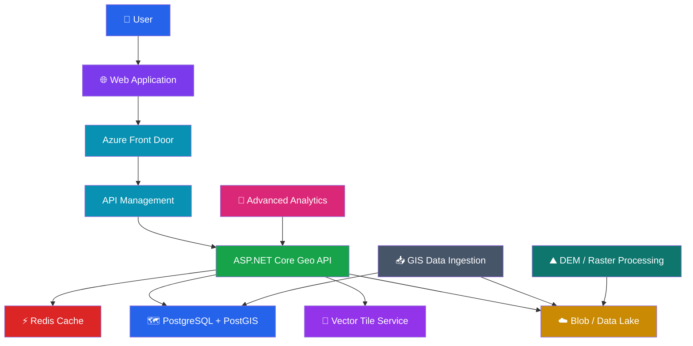
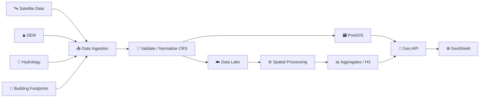

# 🛡️ GeoShield — Geospatial Risk Explorer


---

## 🌍 What is GeoShield?

**GeoShield** is a geospatial risk-screening application designed to help infrastructure, engineering, insurance and operations teams answer an important question quickly:

> **"Could this location or infrastructure asset be exposed to geographic and environmental risk?"**

Instead of forcing users to work with disconnected GIS datasets, GeoShield provides a simple operational workflow where a user can select an area, inspect geospatial indicators and receive a fast, explainable screening result.

The current application is intentionally lightweight and browser-based, while the architecture is designed to evolve into a **production geospatial platform backed by spatial databases, raster data, APIs, vector tiles and cloud infrastructure.**

---

# 🎯 Problem We Are Solving

Modern infrastructure teams often need to evaluate locations before investing time in detailed engineering analysis.

The required information may exist in completely different systems:

```text
🏢 Building Footprints
        +
🌊 Rivers / Water Bodies
        +
⛰️ Elevation / DEM
        +
🛰️ Satellite Imagery
        +
📍 Asset Location
        +
🗺️ Administrative Boundaries
        ↓
   GIS Analysis
        ↓
   Risk Assessment
```

This creates several problems:

- Data is distributed across multiple sources.
- GIS analysis can be computationally expensive.
- Large spatial datasets are difficult to render directly in browsers.
- Public APIs are not designed to be queried directly at enterprise scale.
- Users often need an initial answer before detailed analysis is available.
- Raw geospatial data is difficult for non-GIS users to interpret.

### 💡 GeoShield's approach

GeoShield provides a **fast first-pass screening layer** before expensive detailed analysis.

```text
                 LOCATION
                    │
                    ▼
          ┌──────────────────┐
          │   GeoShield      │
          │  Risk Screening  │
          └────────┬─────────┘
                   │
        ┌──────────┼──────────┐
        ▼          ▼          ▼
     🏢 Assets   🌊 Water   ⛰ Terrain
        │          │          │
        └──────────┼──────────┘
                   ▼
            📊 Risk Indicators
                   │
                   ▼
        ⚡ Fast Explainable Result
```

---

# 🚀 Why Is This Useful?

GeoShield can act as an **early-stage geospatial decision-support system**.

### Example

An infrastructure company wants to evaluate 5,000 potential locations.

Instead of running an expensive detailed hydraulic model against every location:

```text
5,000 Locations
      │
      ▼
┌─────────────────────┐
│ GeoShield Screening │
└──────────┬──────────┘
           │
     ┌─────┴─────┐
     ▼           ▼
   Lower       Higher
   Risk        Risk
     │           │
     ▼           ▼
  Fast-track   Detailed
  screening    engineering
               analysis
```

This can help teams prioritize where expensive analysis should be performed.

### Potential use cases

| Industry | Example |
|---|---|
| 🏗️ Infrastructure | Screen proposed construction locations |
| 🏢 Real Estate | Evaluate site exposure |
| 🛡️ Insurance | Initial property risk screening |
| 🚚 Logistics | Evaluate warehouses and distribution hubs |
| ⚡ Utilities | Screen critical infrastructure |
| 🚆 Transportation | Evaluate transport corridors |
| 🏙️ Smart Cities | Urban environmental analysis |
| 🌾 Agriculture | Geographic/environmental suitability screening |
| 🛰️ Remote Sensing | Combine satellite and GIS indicators |
| 🌊 Disaster Management | Prioritize areas for deeper assessment |

---

# 🧭 Workflow

The application follows a progressive geospatial-analysis workflow.



---

# ⚡ Current Application Workflow

```text
User
 │
 │ Latitude / Longitude / Radius
 ▼
┌───────────────────────────────┐
│       GeoShield UI            │
└───────────────┬───────────────┘
                │
                ▼
       ┌────────────────┐
       │ Fast Screening │
       └───────┬────────┘
               │
       ┌───────┼────────┐
       ▼       ▼        ▼
   Buildings Water   Terrain
       │       │        │
       └───────┼────────┘
               ▼
        Risk Indicators
               │
               ▼
          Risk Score
               │
               ▼
       Export JSON Report
```

The first-pass result is intentionally fast so that the user does not have to wait for expensive geospatial processing before seeing useful information.

---

# ✨ Current Features

## 📍 1. Geospatial Location Input

Users can specify:

- Latitude
- Longitude
- Analysis radius

Example:

```text
Latitude   : 17.3850
Longitude  : 78.4867
Radius     : 2 km
```

---

## 🎯 2. Area of Interest — AOI

GeoShield creates an analysis boundary around the selected coordinate.

```text
             ┌─────────────────┐
             │                 │
             │       📍        │
             │      Asset      │
             │                 │
             └─────────────────┘
                    AOI
```

The AOI becomes the basis for subsequent spatial analysis.

---

## 🏢 3. Building Density Screening

The application estimates building density around the selected location.

This helps answer:

> "How much built infrastructure exists around this location?"

The production version will replace browser-side estimates with indexed spatial queries against building footprint datasets.

---

## 🌊 4. Hydrology Screening

GeoShield provides a water-proximity indicator.

Potential inputs in the production architecture include:

- Rivers
- Streams
- Lakes
- Reservoirs
- Drainage networks
- Flood zones
- Historical flood boundaries

---

## ⛰️ 5. Terrain Visualization

Terrain is an important component of geospatial risk analysis.

Future terrain analysis will incorporate:

- DEM
- Elevation
- Slope
- Aspect
- Drainage direction
- Flow accumulation
- Watershed boundaries

---

## 🚦 6. Explainable Risk Score

GeoShield produces an initial screening score rather than a black-box prediction.

Example:

```text
Risk Score
━━━━━━━━━━━━━━━━━━━━━━━━
        72 / 100
━━━━━━━━━━━━━━━━━━━━━━━━

🟠 Medium / High Screening Risk
```

The objective is to expose the indicators contributing to the result.

---

## ⚡ 7. Performance-First Design

The application follows a **progressive analysis** strategy.

Instead of:

```text
Request
  ↓
Download huge GIS dataset
  ↓
Process everything
  ↓
Render everything
  ↓
Finally show result
```

GeoShield aims for:

```text
Request
  ↓
Fast Screening
  ↓
Immediate Result ⚡
  ↓
Progressive Enrichment
  ↓
Detailed Visualization
```

---

## 📄 8. JSON Report Export

Users can export the screening result as JSON.

Example:

```json
{
  "product": "GeoShield",
  "coordinates": {
    "latitude": 17.385,
    "longitude": 78.4867
  },
  "radiusKm": 2,
  "riskScore": 72,
  "estimatedBuildings": 245,
  "nearestWaterIndicator": "1.20 km"
}
```

---

# 🛠️ Technology Stack

## Current Frontend

```text
HTML5
   │
CSS3
   │
JavaScript
   │
DOM APIs
   │
Browser-based Geospatial Visualization
```

### Technologies

- HTML5
- CSS3
- Vanilla JavaScript
- Responsive CSS
- Browser DOM APIs
- JSON
- SVG/CSS-based visualization

The standalone demonstration deliberately avoids framework dependencies.

---

# 🏗️ Target Production Technology Stack

The application is designed to evolve into an enterprise geospatial platform.

### Backend

- C#
- .NET / ASP.NET Core
- REST APIs
- Background processing
- Distributed caching

### Geospatial

- PostGIS
- Spatial indexes
- GDAL
- GeoJSON
- GeoPackage
- Vector Tiles
- Raster processing
- DEM
- H3 / S2 spatial indexing

### Cloud

- Microsoft Azure
- Azure App Service / Container Apps
- Azure Kubernetes Service
- Azure Blob Storage / Data Lake
- Azure Functions
- Azure Data Factory
- Azure Databricks
- Azure API Management
- Azure Front Door

### Data

```text
PostgreSQL
      +
PostGIS
      +
Object Storage
      +
Raster / DEM
      +
Vector Tiles
```

### Performance

- Redis
- CDN
- Spatial indexes
- H3/S2 aggregation
- Precomputed statistics
- Tile-based rendering
- Async processing

---

# 🏛️ Production Architecture

The current standalone application is only the UI/prototype layer.

The target architecture is:



---

# 🧩 Why PostGIS?

A production system should not repeatedly download raw geospatial data into the browser.

Instead:

```text
Browser
   │
   │ "Give me risk indicators for this AOI"
   ▼
Geo API
   │
   ▼
PostGIS
   │
   ├── Spatial Index
   ├── ST_Intersects
   ├── ST_DWithin
   ├── ST_Contains
   ├── ST_Distance
   └── ST_Within
   │
   ▼
Aggregated Result
```

Example query concept:

```sql
SELECT COUNT(*)
FROM building
WHERE ST_DWithin(
    geometry,
    ST_SetSRID(ST_MakePoint(:longitude, :latitude), 4326),
    :radius
);
```

This is substantially more appropriate for enterprise geospatial workloads than querying a public API directly from a browser.

---

# ⚡ Performance Strategy

GeoShield is being designed around **spatial scalability**.

### ❌ Avoid

```text
Browser
   ↓
Public GIS API
   ↓
Millions of features
   ↓
Browser rendering
```

### ✅ Target

```text
Browser
   ↓
Cached Geo API
   ↓
Spatial Index
   ↓
Aggregated Result
   ↓
Vector Tiles
```

### Performance techniques

- Spatial indexes
- Bounding-box filtering
- H3/S2 cells
- Vector tiles
- Progressive loading
- Result caching
- Redis
- CDN
- Precomputed aggregates
- Async raster processing
- Limited viewport rendering

---

# 🗺️ Geospatial Data Pipeline

The planned ingestion architecture:



---

# 🔐 Production Considerations

Future versions will include:

- Authentication
- OAuth / OpenID Connect
- Role-based access control
- API throttling
- Audit logging
- Dataset versioning
- Data lineage
- CRS validation
- Data-quality checks
- Observability
- Distributed tracing
- Error handling
- Retry policies
- API versioning

---

# 📈 Roadmap

## 🟢 Phase 1 — Current

- [x] Responsive geospatial UI
- [x] Location input
- [x] AOI visualization
- [x] Building screening
- [x] Hydrology indicator
- [x] Terrain visualization
- [x] Risk score
- [x] Performance-first workflow
- [x] JSON export
- [x] Standalone browser mode
- [x] No external dependency requirement

---

## 🟡 Phase 2 — Real GIS Data

- [ ] Real building footprints
- [ ] Real hydrology datasets
- [ ] Real DEM integration
- [ ] GeoJSON ingestion
- [ ] CRS transformation
- [ ] PostGIS spatial database
- [ ] Spatial indexing
- [ ] Real distance/intersection calculations

---

## 🟠 Phase 3 — Enterprise Geo API

- [ ] ASP.NET Core Geo API
- [ ] REST endpoints
- [ ] API Management
- [ ] Redis caching
- [ ] Authentication
- [ ] Authorization
- [ ] Dataset versioning
- [ ] Observability
- [ ] Structured logging

---

## 🔵 Phase 4 — High-Performance Mapping

- [ ] Vector tiles
- [ ] H3 spatial indexing
- [ ] Viewport-based loading
- [ ] CDN caching
- [ ] Progressive rendering
- [ ] Large-scale feature clustering
- [ ] Million-feature visualization

---

## 🟣 Phase 5 — Advanced Risk Analytics

- [ ] Elevation-based risk
- [ ] Slope analysis
- [ ] Flow accumulation
- [ ] Watershed analysis
- [ ] Historical flood analysis
- [ ] Flood-depth modeling
- [ ] Infrastructure vulnerability scoring
- [ ] Explainable risk factors

---

## 🤖 Phase 6 — AI / ML

Future versions can introduce machine-learning models for:

```text
Historical Flood Data
        +
Rainfall
        +
Elevation
        +
Hydrology
        +
Land Use
        +
Infrastructure
        ↓
   ML / AI Model
        ↓
Risk Probability
        +
Explainability
```

Potential technologies:

- Python
- PyTorch
- scikit-learn
- PySpark
- Azure Machine Learning
- Azure AI services
- Geospatial ML

AI will be introduced **after establishing reliable geospatial data pipelines**, rather than using AI as a replacement for fundamental spatial analysis.

---

# 📊 Current vs Target

| Capability | Current | Target |
|---|---:|---:|
| Interactive UI | ✅ | ✅ |
| Standalone execution | ✅ | — |
| Risk screening | ✅ | Advanced |
| Building analysis | Screening | Real GIS |
| Hydrology | Indicator | Real datasets |
| Terrain | Visualization | DEM analytics |
| Spatial database | — | PostGIS |
| Spatial indexes | — | PostGIS/H3 |
| Vector tiles | — | ✅ |
| Redis | — | ✅ |
| Geo API | — | ASP.NET Core |
| Authentication | — | ✅ |
| Real-time GIS data | — | ✅ |
| ML risk prediction | — | Future |
| Enterprise deployment | Prototype | Azure |

---

# 🎓 Engineering Concepts Demonstrated

GeoShield is also designed as a practical demonstration of senior-level engineering concepts:

### Software Architecture

- Modular architecture
- Separation of concerns
- API-first design
- Progressive enrichment
- Performance-oriented design
- Production scalability

### Distributed Systems

- Caching
- Async processing
- CDN
- API gateways
- Background processing
- Horizontal scaling

### Geospatial Engineering

- Coordinate systems
- Spatial queries
- Spatial indexes
- Raster vs vector data
- AOI
- Distance calculations
- Spatial intersections
- Vector tiles
- H3/S2 indexing

### Cloud Engineering

- Azure PaaS
- Data Lake
- API Management
- Kubernetes
- Distributed caching
- Observability

---

# 🧪 Running Locally

The current standalone version requires no build step.

```bash
git clone https://github.com/<your-username>/geoshield.git
cd geoshield
```

Then open:

```text
index.html
```

directly in a browser.

No:

```text
npm install
npm build
dotnet run
```

is required for the standalone demonstration.

---

# ⚠️ Important Disclaimer

GeoShield's current risk score is a **screening demonstration**.

It is not a substitute for:

- Certified flood models
- Hydraulic modelling
- Engineering surveys
- Regulatory analysis
- Insurance underwriting models
- Emergency management systems

Production decisions should use authoritative and validated geospatial datasets and domain-specific models.

---

# 🌟 Vision

The long-term goal is to evolve GeoShield from a browser-based demonstration into a scalable **Geospatial Decision Intelligence Platform**.

```text
                 GEOSPATIAL DATA
                       │
       ┌───────────────┼────────────────┐
       ▼               ▼                ▼
   🛰️ Satellite      ⛰️ DEM          🌊 Hydrology
       │               │                │
       └───────────────┼────────────────┘
                       ▼
                  🗺️ PostGIS
                       │
                 Spatial Engine
                       │
            ┌──────────┴──────────┐
            ▼                     ▼
       📊 Analytics           🤖 ML / AI
            │                     │
            └──────────┬──────────┘
                       ▼
                  🛡️ GeoShield
                       │
             ┌─────────┴─────────┐
             ▼                   ▼
       Risk Screening       Decision Support
```

**GeoShield is not just a map. The goal is to build a geospatial intelligence layer that turns complex spatial data into fast, explainable and actionable decisions.**

---

## 🏷️ Tags

```text
geospatial
gis
geospatial-analysis
geospatial-engineering
spatial-computing
postgis
postgresql
geodata
geojson
vector-tiles
raster
dem
digital-elevation-model
hydrology
flood-risk
risk-analysis
location-intelligence
spatial-database
spatial-index
h3
s2
javascript
html5
css3
dotnet
aspnet-core
azure
azure-cloud
microservices
distributed-systems
software-architecture
solution-architecture
machine-learning
geospatial-ai
```

---

## ⭐ If you find this project useful

Give the repository a ⭐ and follow the project as GeoShield evolves toward a production-grade geospatial intelligence platform.
